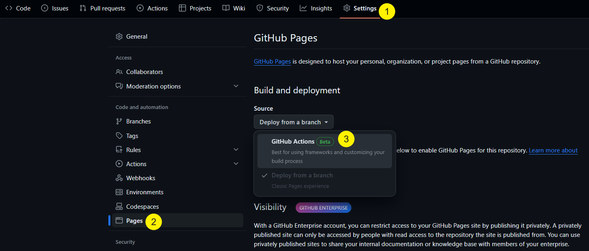

# 部署(deployment)

## 如何自動部署

### 使用 GitHub Action 自動部署



將以下 yaml 貼到 `./.github/workflows/deploy.yml`

```yaml,filepath=./.github/workflows/deploy.yml
name: Deploy
on:
  push:
    branches:
      - main

jobs:
  deploy:
    runs-on: ubuntu-latest
    permissions:
      contents: write # To push a branch
      pages: write # To push to a GitHub Pages site
      id-token: write # To update the deployment status
    steps:
      - uses: actions/checkout@v4
        with:
          fetch-depth: 0
      - name: Install latest mdbook
        run: |
          tag=$(curl 'https://api.github.com/repos/rust-lang/mdbook/releases/latest' | jq -r '.tag_name')
          url="https://github.com/rust-lang/mdbook/releases/download/${tag}/mdbook-${tag}-x86_64-unknown-linux-gnu.tar.gz"
          mkdir mdbook
          curl -sSL $url | tar -xz --directory=./mdbook
          echo `pwd`/mdbook >> $GITHUB_PATH
      - name: Build Book
        run: |
          # This assumes your book is in the root of your repository.
          # Just add a `cd` here if you need to change to another directory.
          mdbook build
      - name: Setup Pages
        uses: actions/configure-pages@v2
      - name: Upload artifact
        uses: actions/upload-pages-artifact@v1
        with:
          # Upload entire repository
          path: "book"
      - name: Deploy to GitHub Pages
        id: deployment
        uses: actions/deploy-pages@v1
```

### 從分支部署
